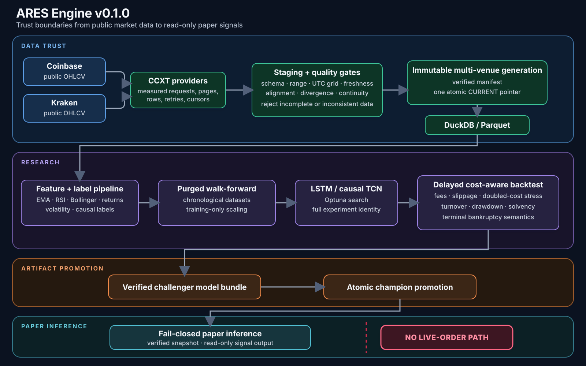

# ARES Engine

> An open-source machine-learning trading research and paper-inference engine for ETH market-data experimentation.

Project overview, architecture, and documented limitations: https://arjia.tech/ares-engine

<p align="center">
  
</p>

ARES ingests public exchange candles, rejects inconsistent data, builds backward-looking features, trains sequence models, runs chronological cost-aware validation, exports verified bundles, and emits read-only paper signals. It does not place orders, manage balances, require exchange credentials, establish profitability, or provide investment advice.

The Python distribution is `ares-eth-engine`; the import package is `ares_engine`; the CLI is `ares`. The implementation follows the supplied Whiplash technical dossier where practical, but that dossier is a specification—not source code or evidence of correctness.

## See ARES in action

ARES is an ML trading research and paper-inference engine with a deliberately absent live-order path.

### Compact authentic-command demo


This compact inline sequence condenses the authentic 63-second demonstration into six readable scenes. Training and network idle time are omitted; the displayed output comes from the recorded ARES runs described in [the demo capture notes](docs/launch/demo/README.md).

### Architecture



**Clone ARES, run the verifier, and try to break the public-data pipeline.** Read the [launch story](docs/launch/ARES_V0.1.0_LAUNCH_POST.md), then [open a sanitized failure report](https://github.com/ArjiaTechnologies/ares-engine/issues/new?template=public-ingestion-report.yml) if you find an edge case.

## Safety boundary

- Public market data only by default; configured credential fields are rejected by the public-ingestion audit.
- No order-routing methods or live-capital path.
- Paper inference blocks malformed, stale, open-candle, mismatched, divergent, or non-finite feeds.
- Backtest insolvency is terminal: equity becomes zero, stays zero, and the candidate fails gates.
- Bundles are verified and loaded from a private re-hashed snapshot. `joblib` and Keras deserialization still require a trusted publisher; SHA-256 detects change but does not authenticate authorship.
- Research scores are model-selection estimates, not investment advice or evidence of an edge.
- Historical performance is not evidence of future results.
- Public endpoint compatibility can change as exchanges, CCXT mappings, schemas, limits, and retention policies evolve.

See [DISCLAIMER.md](DISCLAIMER.md), [SECURITY.md](SECURITY.md), and [docs/research_protocol.md](docs/research_protocol.md).

## Implemented system

- Credential-free Coinbase primary and Kraken validation OHLCV ingestion through CCXT.
- Measured transport telemetry: HTTP requests, `fetch_ohlcv` calls, pages, raw/normalized/deduplicated rows, cursor progression, retries, statuses, empty and short pages.
- Full-range, schema, UTC-grid, continuity, OHLC, volume, freshness, alignment, and cross-venue divergence gates.
- Immutable multi-venue generations under `data/snapshots/<generation>/`, verified manifests, and one atomic `CURRENT` pointer. Readers capture a generation once and cannot observe mixed venue state.
- Parquet as canonical storage and a DuckDB view bound to the captured generation.
- EMA, Wilder RSI, Bollinger, log-return, realized-volatility, volume-state, and range features.
- k-ahead dead-zone and triple-barrier labels; same-candle dual barrier hits are neutral.
- Fixed-length sequences, purged expanding-window folds, and training-fold-only scaling.
- TensorFlow/Keras LSTM and causal residual TCN models.
- Optuna study isolation over the full normalized OHLCV payload and every material research configuration.
- An explicit one-time, post-search final holdout with a maximum-horizon embargo, frozen configurations, independent research-only early stopping, immutable commitment receipts, and reproducible cash/buy-and-hold/causal-momentum baselines.
- A promotion-time recent-window replay that reserves the latest configured bars before search or fitting, binds the frozen challenger and source bytes into an immutable report, reruns delayed normal/stress-cost backtests, and anchors passing evidence in the champion pointer.
- Delayed long/flat/short backtesting with fees, slippage, doubled-cost stress, drawdown, turnover, exposure, hit rate, trade counts, and bankruptcy reporting.
- Immutable seven-file bundles, hostile-file checks, runtime shape validation, manifest-anchored promotion, and fail-closed paper inference.
- Process locks for ingestion, scheduler cycles, promotion, and paper-signal logs.
- Python 3.11–3.13 CI, ML/package/Docker jobs, CodeQL, dependency review, and a manual-only public-ingestion workflow.
- Tag-only release automation builds checksummed wheel/sdist artifacts and a CycloneDX SBOM for a draft GitHub release; it never publishes to PyPI or contacts exchanges.

The detailed component map is in [docs/architecture.md](docs/architecture.md) and [docs/dossier_mapping.md](docs/dossier_mapping.md).

## Quick start

Python 3.11, 3.12, and 3.13 are supported. TensorFlow is the reference ML backend.

```bash
git clone https://github.com/ArjiaTechnologies/ares-engine.git
cd ares-engine
uv sync --extra dev --extra ml
uv run ares doctor
uv run ares demo --bars 500
uv run ares verify-offline --config configs/smoke.yaml --bars 2000
```

On a platform without a TensorFlow wheel, Keras with Torch can be used as a compatibility backend:

```bash
uv sync --extra dev --extra ml-torch
ARES_KERAS_BACKEND=torch uv run ares verify-offline --config configs/smoke.yaml --bars 2000
```

## Public-data workflow

```bash
uv run ares ingest --config configs/default.yaml
uv run ares quality --config configs/default.yaml
uv run ares validate --config configs/default.yaml
uv run ares locked-holdout --config configs/default.yaml --holdout-bars 720
uv run ares prepare-challenger --config configs/default.yaml --name ares_candidate_001
uv run ares promote artifacts/ares_candidate_001 \
  --config artifacts/best_config.yaml \
  --replay-report artifacts/replays/ares_candidate_001.json
uv run ares paper --config artifacts/best_config.yaml
```

The bounded evidence workflow contacts only public endpoints and writes independently re-openable evidence. The [stress-test instructions](#try-to-break-the-public-data-pipeline) select a safely closed interval, run the request twice in isolated storage, and validate the resulting traces, reports, Parquet contents, manifests, and hashes. The authoritative execution evidence is recorded in [docs/audits/sol/SOL_LIVE_INGESTION_EVIDENCE.md](docs/audits/sol/SOL_LIVE_INGESTION_EVIDENCE.md).

## Try to break the public-data pipeline

```bash
git clone https://github.com/ArjiaTechnologies/ares-engine.git
cd ares-engine
uv sync --extra dev --extra ml
uv run ares doctor
uv run ares demo --bars 500

eval "$(uv run python - <<'PY'
from datetime import UTC, datetime, timedelta
end = datetime.now(UTC).replace(minute=0, second=0, microsecond=0) - timedelta(hours=72)
start = end - timedelta(days=15)
print(f'ARES_START={start:%Y-%m-%dT%H:%M:%SZ}')
print(f'ARES_END={end:%Y-%m-%dT%H:%M:%SZ}')
PY
)"
uv run ares verify-public-ingestion \
  --primary coinbase --validation kraken \
  --symbol ETH/USD --timeframe 1h \
  --start "$ARES_START" --end "$ARES_END" \
  --page-limit 60 --retries 3 \
  --output artifacts/public-ingestion-audit
uv run ares validate-ingestion-report artifacts/public-ingestion-audit
```

A useful issue includes your OS, architecture, Python version, ARES commit, installation method, exchange pair, symbol, timeframe, exact command, exit code, sanitized report or hashes, expected behavior, observed behavior, and whether the failure reproduces. **Never include credentials, tokens, account data, cookies, private datasets, or private model bundles.** Use the [public-ingestion report template](https://github.com/ArjiaTechnologies/ares-engine/issues/new?template=public-ingestion-report.yml).

## Canonical data layout

```text
data/
  CURRENT
  snapshots/
    <generation-id>/
      raw/<exchange>/eth-usd/<timeframe>.parquet
      quality/latest.json
      quality/<source>.json
      ares.duckdb
      manifest.json
  rejected/<run-id>/
  paper/signals.jsonl
artifacts/
  best_params.json
  best_meta.json
  best_config.yaml
  ares_<timestamp>/
    model.keras
    scaler.joblib
    feature_spec.json
    config.json
    metrics.json
    provenance.json
    manifest.json
  champion.json
```

All canonical readers resolve one captured generation ID. Publication builds and verifies the complete generation, flushes its files, and then atomically replaces `CURRENT`. A crash before replacement leaves the old generation active; a crash after replacement exposes only the complete new generation. Recovery is cleanup, not a consistency requirement.

## Scheduler

```bash
uv run ares cycle quick --config configs/default.yaml
uv run ares cycle deep --config configs/default.yaml
uv run ares scheduler --config configs/default.yaml
```

A quick cycle ingests and may emit a champion paper signal. A deep cycle ingests, searches when configured, validates, trains, exports, and attempts promotion. Filesystem locks prevent overlapping mutation.

## Development verification

```bash
uv sync --extra dev --extra ml
uv run python -m compileall -q src tests
uv run ruff check .
uv run ruff format --check .
uv run mypy --strict src
uv run pytest --cov=ares_engine --cov-branch --cov-report=term-missing
uv run pip-audit
uv build
uv run twine check dist/*
```

The current authoritative audit is [docs/audits/sol/SOL_AUDIT.md](docs/audits/sol/SOL_AUDIT.md). Historical Fable 5 material is preserved under `docs/audits/archive/fable5-untrusted/` as superseded AI-assisted review notes, not independent certification.

## Research limitations

The explicit `ares locked-holdout` workflow quarantines its final chronological
partition before Optuna search, embargoes every search-space label horizon,
freezes the selected configuration, fits its scaler and early-stopping split on
research rows only, and consumes the final evaluation before inference starts.
Its cash, buy-and-hold, and causal-momentum baselines use the same delayed,
cost-aware backtest. An interrupted or completed commitment cannot be rerun.
The legacy `ares search`, `ares validate`, and training commands do not imply
that this optional workflow ran; inspect the exact commitment and final report.
No local digest authenticates an author or defends against a hostile same-user
process. A clean holdout remains historical evidence, not profitability, and a
separate forward paper period is still required. OHLC bars cannot establish
intrabar ordering. Fees, slippage, latency, and liquidity are assumptions.
Public exchange history can be incomplete, endpoint compatibility can change,
and market regimes change. Historical performance is not evidence of future
results.

The promotion workflow separately uses `ares prepare-challenger` to reserve the
configured latest window before search, scaling, fitting, or early stopping.
Promotion requires the resulting exact-source, exact-bundle replay report and
recomputes its sample-count, trade-count, drawdown, solvency, and doubled-cost
gates before atomically anchoring the report hash in `champion.json`. The legacy
`ares search` and `ares train` commands remain research primitives; by
themselves they do not produce canonical replay evidence and cannot satisfy the
default promotion policy. A passing replay is still historical evidence, not
profitability or permission to trade.

Before any capital use, a separate execution service would need least-privilege credentials, risk and loss limits, kill switches, reconciliation, observability, incident procedures, independent security review, and an audited forward record. None of that is part of ARES.

## License

MIT. See [LICENSE](LICENSE).
