# Architecture

```mermaid
flowchart LR
    CB[Coinbase OHLCV] --> I[Cursor-complete CCXT fetch]
    KR[Kraken OHLCV] --> I
    I --> S[Stage all venue snapshots in memory]
    S --> Q[Schema, continuity, UTC-grid, OHLC, metadata, freshness and venue gates]
    Q -->|all pass| P[Journaled two-phase Parquet commit with crash roll-forward]
    Q -->|any fail| X[Report and commit nothing]
    P --> D[DuckDB view]
    P --> F[Backward-looking features]
    F --> L[Future-movement labels]
    L --> DS[Fixed-length sequences]
    DS --> W[Purged walk-forward folds]
    W --> M[LSTM or compact TCN]
    M --> B[Delayed cost-aware backtest]
    B --> G[Hard risk gates]
    G --> E[Hash- and metadata-verified model bundle]
    E --> C[Champion/challenger promotion]
    C --> R[Fail-closed paper inference]
```

## Layer boundaries

| Layer | Responsibility | Must not do |
|---|---|---|
| Provider | Fetch normalized OHLCV with an explicit, advancing time cursor | Decide whether data is trustworthy or stop merely because a page is short |
| Ingestion | Stage every configured venue, require requested-range coverage, validate the complete candidate set, and serialize commits | Replace canonical files before all gates pass |
| Quality | Reject malformed, missing, off-grid, stale, mismatched, or divergent data | Repair market history silently |
| Storage | Atomically preserve canonical Parquet and expose a DuckDB view | Duplicate or mutate model logic |
| Features | Use current and past market state only | Read future bars or labels |
| Labels | Encode future outcomes for supervised learning | Become hand-written trading rules |
| Dataset | Build sequences and chronological folds | Fit a scaler on future data |
| Model | Estimate directional probability | Own execution assumptions |
| Backtest | Apply threshold, delay, and costs | Hide turnover or failed folds |
| Search | Rank only candidates that clear hard gates | Select the least-bad failed trial |
| Bundle | Keep model, scaler, features, thresholds, costs, metrics, and provenance together | Load unverified or unlisted files |
| Promotion | Move an atomic champion pointer after gates and score comparison | Mutate old bundles |
| Paper loader | Rebuild the latest complete feature row and emit a read-only signal | Place an order, fall back to stale rows, or bypass failed data gates |

## Trust boundaries

- Raw exchange responses are untrusted until the requested range is covered and every configured venue and cross-venue check passes.
- Candidate snapshots stay in memory until the full batch is valid. A failed batch never replaces canonical Parquet. The commit itself is journaled two-phase: staged files are fsynced, a rename journal is persisted, and an interrupted commit is rolled forward to completion by the next locked ingestion, so canonical multi-venue state converges to the validated snapshot.
- Ingestion and scheduler cycles use fail-fast filesystem locks, so concurrent processes cannot race canonical data or promotion state.
- At least one configured secondary venue is mandatory. Each validator is an independent sanity check, not a source blended into the target, and its newest candle must align with the primary newest candle.
- Scalers are fit inside training folds only; the final exported scaler sees only samples whose labels are finite.
- Signals are delayed one bar and charged on every position change, with a doubled-cost stress path.
- Bundles are immutable; every listed file is size/SHA-256-verified, metadata must agree with config, unexpected files and symlinks are rejected, and the champion pointer anchors the promoted manifest hash.
- Promotion changes only an atomic pointer; it never mutates an existing model bundle.
- Paper inference blocks stale, malformed, mismatched, missing, p95-divergent, latest-candle-divergent, non-finite, or out-of-range inputs and writes no signal.
- Live order execution is intentionally absent.
