# Architecture

```mermaid
flowchart LR
    CB["Coinbase public OHLCV"] --> T["Instrumented CCXT transport"]
    KR["Kraken public OHLCV"] --> T
    T --> S["Stage complete venue set"]
    S --> Q["Coverage, schema, UTC, continuity, OHLCV, freshness, alignment, divergence"]
    Q -->|"fail"| X["Immutable rejected-run evidence"]
    Q -->|"pass"| G["Write and verify immutable generation"]
    G --> P["Atomic CURRENT replacement"]
    P --> D["Captured-generation Parquet and DuckDB readers"]
    D --> F["Backward-looking features"]
    F --> L["Future labels"]
    L --> W["Purged sequences and train-only scaling"]
    W --> M["LSTM or causal TCN"]
    M --> B["Delayed cost-aware backtest"]
    B --> R["Hard gates including solvency"]
    R --> E["Verified immutable bundle"]
    E --> C["Locked champion promotion"]
    C --> I["Fail-closed paper inference"]
```

## System map

| Component | Implementation and invariant |
|---|---|
| Configuration | `config.py`; strict Pydantic models forbid unknown/non-finite values, unsafe exchange/symbol path components, invalid ranges, and missing validation venues. |
| Provider and pagination | `data/providers.py`; an advancing timestamp cursor, bounded retries, closed interval, normalization, and actual transport/page telemetry. Short pages do not imply completion. |
| Quality | `data/quality.py`; schema, finite numeric data, OHLC relationships, duplicates, grid/continuity, requested range, freshness, metadata, alignment, and divergence. |
| Storage publication | `data/storage.py`; all files are written to one new generation, hashed, verified, fsynced where supported, then made visible through atomic `CURRENT`. |
| DuckDB | The view is created inside and bound to one generation. It never globs mutable or abandoned paths. |
| Features and labels | `features.py` and `labels.py`; causal features, explicit warm-up NaNs, k-ahead and triple-barrier labels, neutral ambiguous same-bar dual touches. |
| Sequences and folds | `dataset.py`; fixed history windows, chronological expanding folds, purge at least label horizon, training-fold-only scaler fitting. |
| Models | `models.py`; TensorFlow/Keras LSTM and causal residual TCN, chronological batches, finite prediction checks, `.keras` export/reload. |
| Search | `search.py`; material data/config identity isolates Optuna studies, and only finite, solvent, gate-passing trials are eligible. |
| Backtest | `backtest.py`; one-bar signal delay, position-change costs, explicit turnover/trades, terminal insolvency, and finite metrics. |
| Bundles | `bundles.py`; exact seven-file payload, size/hash/type/link/path checks, metadata/runtime shape validation, and private re-hashed load snapshot. |
| Promotion | `promotion.py`; process lock, re-verification, finite metrics and gates, artifacts-root containment, manifest-anchored atomic champion pointer. |
| Paper | `live.py`; captures one generation, rebuilds exact feature order, blocks open/stale/divergent/non-finite/mismatched input, writes read-only signals under a process lock. |
| Scheduling | `scheduler.py`; one fail-fast process lock serializes ingestion/training/promotion; each operation captures a generation once. |
| CLI | `cli.py`; installed-wheel-safe config resolution and explicit research, evidence, lifecycle, and scheduler commands. |
| Public evidence | `public_audit.py`; two isolated real requests, exact artifacts/traces, canonical hashes, and strict independent recomputation. |
| Packaging | `pyproject.toml`; Python 3.11–3.13, platform-specific TensorFlow markers, configs embedded in the wheel. |
| Docker | Multi-stage non-root image; the ML target includes the reference TensorFlow backend and writable data/artifact directories. |
| CI/release | Python matrix, ML, package/wheel, audit, Docker, CodeQL, dependency review, and manual public ingestion. A tag-only workflow stages checksummed distributions and a CycloneDX SBOM as a draft GitHub release; it never publishes to PyPI. |

## Publication state machine

1. Acquire the ingestion process lock.
2. Capture the current generation and build complete merged venue candidates in memory.
3. Validate every venue and cross-venue gate.
4. Write Parquet, quality reports, DuckDB, and a manifest under a fresh immutable generation ID.
5. Re-open and verify hashes, types, paths, row metadata, and generation completeness.
6. Fsync generation files/directories where supported.
7. Write a temporary pointer, fsync it, and atomically replace `CURRENT`.
8. Readers capture `CURRENT` once and resolve all files under that generation.

An interruption in steps 1–6 leaves the old generation active. After step 7, the complete new generation is active. Abandoned generation cleanup is optional and cannot restore or damage reader consistency.

## Trust and scope

The filesystem, Python runtime, dependency registry, TLS trust store, CCXT, TensorFlow/Keras, and trusted bundle publisher remain external trust roots. The engine has no authenticated exchange call or order path. It emits only research artifacts and paper signals.
